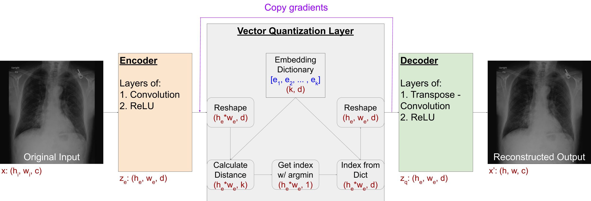
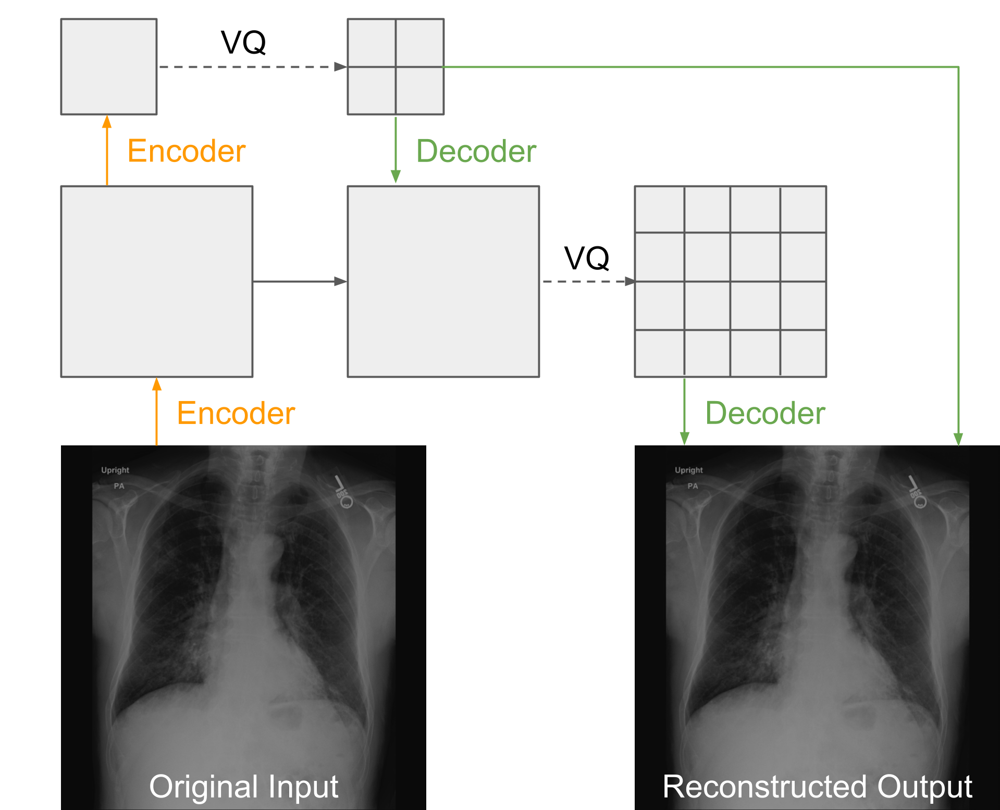
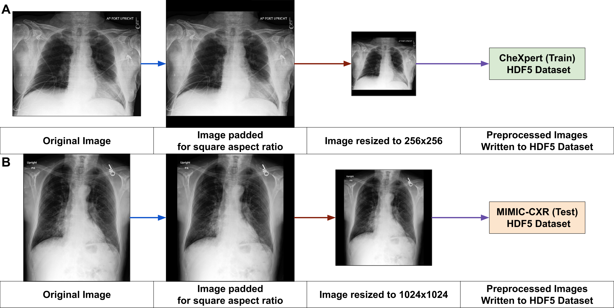
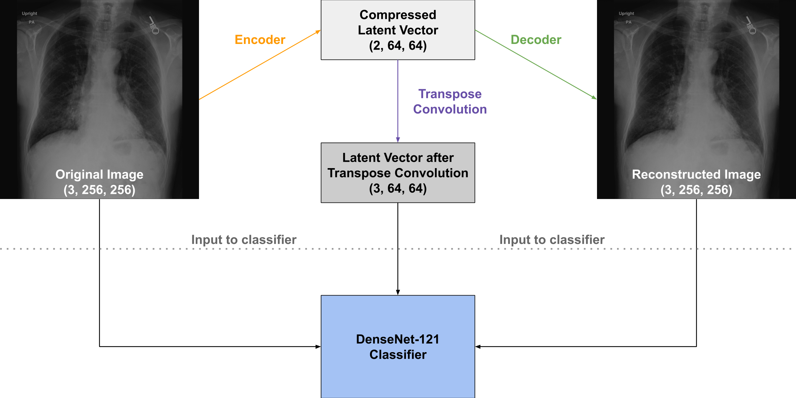
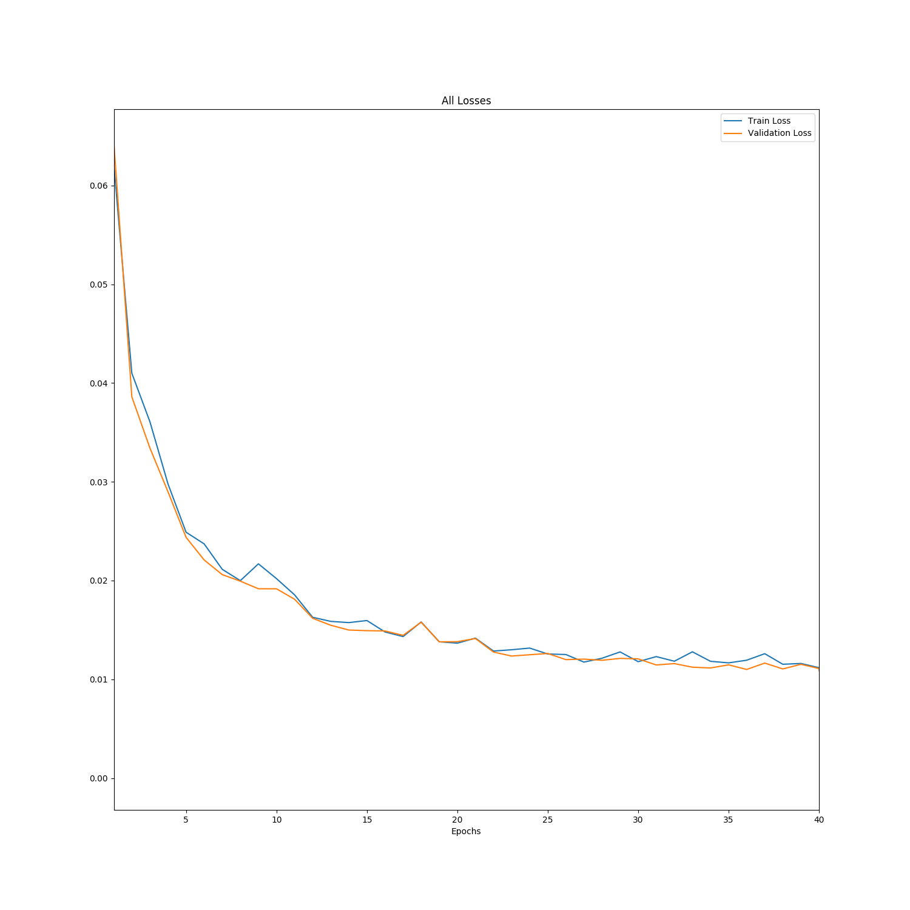
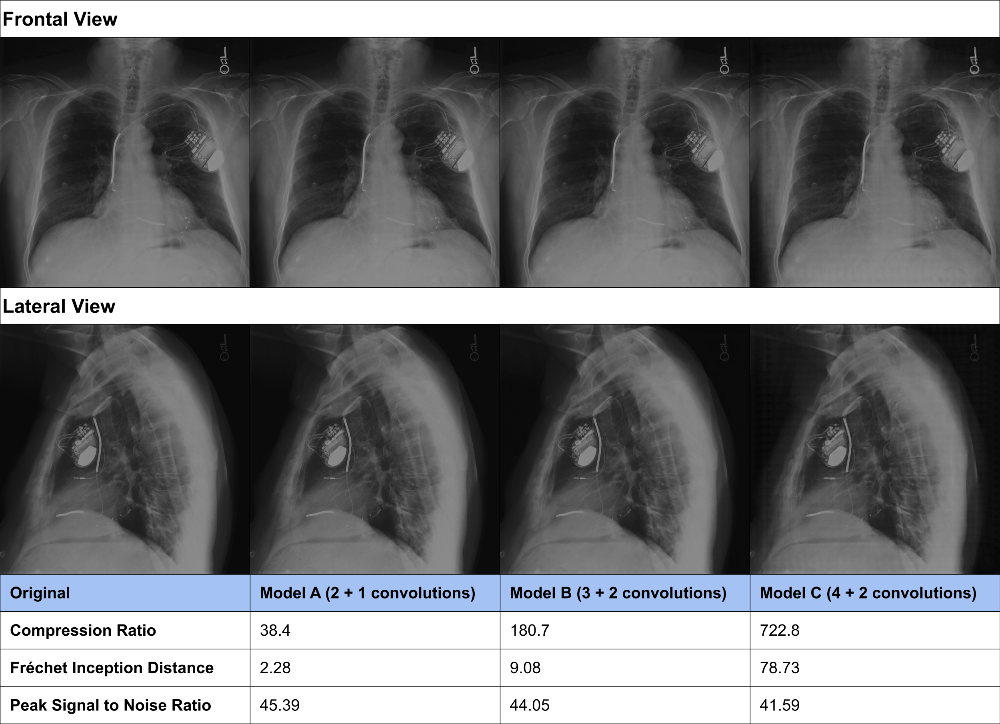
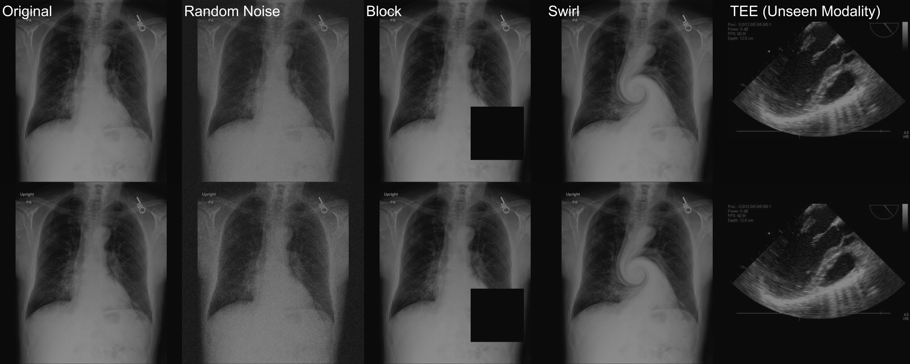
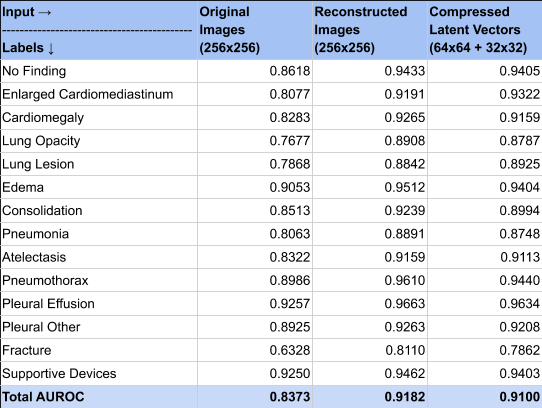

# Medical Image Compression with VQ-VAE-2 in PyTorch
This repository has repurposed the generative architecture of [Razabi et al.'s Multi-Level Vector Quantized Variational AutoEncoder (VQ-VAE-2)](https://arxiv.org/abs/1906.00446) to compress medical images in PyTorch. 

Additionally, the compressed latent vectors and reconstructed images have been used to train the [CheXNet](https://stanfordmlgroup.github.io/projects/chexnet/) (DenseNet-121 pre-trained on ImageNet) algorithm. 

## Usage

### Architecture
This repository supports two-level VQ-VAE (top and bottom hierachical layers). The vector quantization workflow is outline below.



Two levels of convolution based encoding captures both local (first-layer) and global (second-layer) features. 



We converted our datasets into [HDF5 formats](https://portal.hdfgroup.org/display/HDF5/HDF5) as inputs for faster training. We used the [MIMIC-CXR](https://physionet.org/content/mimic-cxr/2.0.0/) and the [CheXpert](https://stanfordmlgroup.github.io/competitions/chexpert/) datasets for training and external validation.

### Prerequisites

* python3
* PyTorch (torch)
* torchvision
* HDF5 (h5py)
* numpy
* tqdm
* matplotlib
* scikit-learn (sklearn)


## Getting Started

### Create HDF5 Dataset

We used HDF5 datasets to create and save padded images such that the training does not require pre-processing each time.



### Training

1. To run the VQ VAE training script using the default hyperparameters:

```
python train_vqvae.py --data_path=[HDF5 TRAIN DATASET PATH] --save_path=[SAVE PATH]
```

2. To increase the compression ratio, change the stride at each hierarchy with `first_stride` or `second_stride` flags:

```
python train_vqvae.py --data_path=[HDF5 TRAIN DATASET PATH] --save_path=[SAVE PATH] --first_stride=4
```
Note: strides increase in multiples of 2: `2, 4, 8, 16`

3. To run the training of DenseNet-121 classifier:

```
python train_densenet.py --vqvae_file=[CHECK POINT FILE FROM ABOVE TRAINING]
```
The training of DenseNet-121 can be conducted with original images, latent vectors, or reconstructed images:



Note: checkpoint files can be found in the `[save_path]/ceckpoints` directory from the training.

### Testing

1. Use the `test_model.ipynb` Jupyter Notebook to:
* create a padded image from any image file to fit into a square perspective ratio
* save reconstructed images from trained models
* calculate PSNR from saved images (from `create_images.py`)

Note: loading saved models require CUDA enabled devices. If the device does not have CUDA, load the file with:

```
torch.load('checkpoint.pt', location: 'cpu')
```

2. To run the profiling code on DenseNet-121 training, comment out the `@profile` decorator in `line 266` of `networks.py`. Once the training is complete, the `pytorch_memblab` library will output the profiling info directly to terminal:
```
Line # Max usage   Peak usage diff max diff peak  Line Contents
===============================================================
   266                                               @profile
   267                                               def forward(self, input):
   268   108.90M      164.00M   79.89M  118.00M          if self.input_type == 'latent':
   269   111.90M      164.00M    3.00M    0.00B              input = self.init_conv(input)  # convert to 3 channel input
   270   770.49M      788.00M  658.59M  624.00M          output = self.model(input)
   271   770.49M      840.00M    0.00B   52.00M          return output
```


### Results

1. Loss curves are automatically generated in the `[save_path]` directory from the training.



2. Reconstruction performance is satisfactory when evaluated with external datasets. In the example below, the algorithm trained with the CheXpert dataset (frontal view) and externally validated with the MIMIC-CXR dataset (both frontal and lateral views).



The trained model is robust to various input manipulations. Input image above, reconstructed image below:



3. Classification performance of DenseNet-121 as determined by AUROC was satisfactory with the original and actually **increased** reconstructed, *and* **compressed latent vector** as input. We suspect that the VQ-VAE-2 is acting as a denoising autoencoder.



Download links for: [saved models](https://app.box.com/s/5kr33l9qx61maolzyb5zspac5ml9tnc2) and [original and reconstructed images from the validation MIMIC-CXR dataset](https://app.box.com/s/16fpwv9jvi99a290wssk7nc7esfol5ci)


## Authors

* **Young Joon (Fred) Kwon MS** |[github](https://github.com/kwonfred)|[linkedin](https://www.linkedin.com/in/kwonfred/)| MD PhD Student; Icahn School of Medicine at Mount Sinai
* G Anthony (Tony) Reina MD |[github](https://github.com/tonyreina)|[linkedin](https://www.linkedin.com/in/skysurgery/)| Chief AI Architect for Health & Life Sciences; Intel Corporation
* Ping Tak Peter Tang PhD |[github](https://github.com/PingTakPeterTang)|[linkedin](https://www.linkedin.com/in/pingtakpetertang/)| Research Scientist; Facebook
* Eric K Oermann MD |[github](https://github.com/RespectableGlioma)|[linkedin](https://www.linkedin.com/in/eric-oermann-b829528/)| Instructor, Department of Neurosurgery; Director, AISINAI; Icahn School of Medicine at Mount Sinai
* Anthony B Costa PhD |[github](https://github.com/acoastalfog)|[linkedin](https://www.linkedin.com/in/anthony-costa-17005a64/)| Assistant Professor, Department of Neurosurgery; Director, Sinai BioDesign; Icahn School of Medicine at Mount Sinai


## License

This project is licensed under the APACHE License, version 2.0 - see the [LICENSE.txt](LICENSE.txt) file for details


## Acknowledgments

* MSTP T32 NIH T32 GM007280
* RSNA Medical Student Research Grant
* Intel Software and Services Group Research Grant
